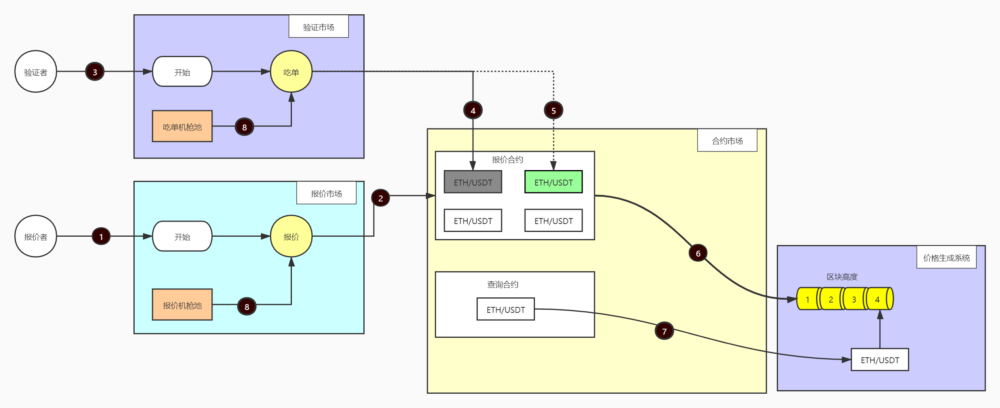

# hzl-sol

#### 介绍
Hazel是一个面向区块链提供去中心化的预言服务，基于波卡（Polkadot）基础上的新一代可验证的计算预言机，旨在通过共识机制、智能合约 、可信计算、隐私保护以及链上链下数据的交互，并真正支持高并发企业级互联网应用的链上运行。 

我们期望提供一种基于事件资产抵押的数据预测服务，以及基于事实验证的数据修正机制。通过事实背书解决区块链可信数据源的根本问题。
这需要满足2个基础条件
* 通过资产抵押来建立与事实的价格映射关系
* 通过市场套利来实现事件数据的自发修正

#### 合约架构

#### 安装教程
[待完善]
1.  xxxx
2.  xxxx
3.  xxxx

#### 使用说明
[待完善]
1.  xxxx
2.  xxxx
3.  xxxx

#### 参与贡献

1.  Fork 本仓库
2.  新建 Feat_xxx 分支
3.  提交代码
4.  新建 Pull Request

