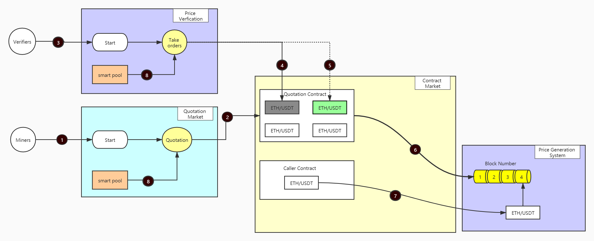

# hzl-sol

#### Description
Hazel is a blockchain-oriented prediction service which features decentralization, or more specifically, a new generation of verifiable oracle machine based on Polkadot. It aims to exactly support the on-chain operation of enterprise-level Internet applications with high-concurrency through consensus mechanisms, smart contracts, trusted computing, privacy protection and the interaction of on-chain and off-chain data.

We expect to provide a data-driven prediction service based on the asset-backed events and a data-correction mechanism based on fact checking. This mechanism could resolve fundamental problems about trusted source of data of blockchain through endorsement of facts.

The realization of effects mentioned above needs to meet 2 basic conditions:
* To establish a mapping relationship on price of facts through the pledging of assets
* To realize spontaneous correction of event data through market arbitrage

#### Contract Architecture

#### Installation
[To be perfected]
1.  xxxx
2.  xxxx
3.  xxxx

#### Instructions
[To be perfected]
1.  xxxx
2.  xxxx
3.  xxxx

#### Contribution

1.  Fork the repository
2.  Create Feat_xxx branch
3.  Commit your code
4.  Create Pull Request

